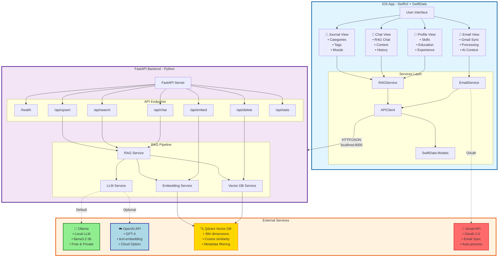
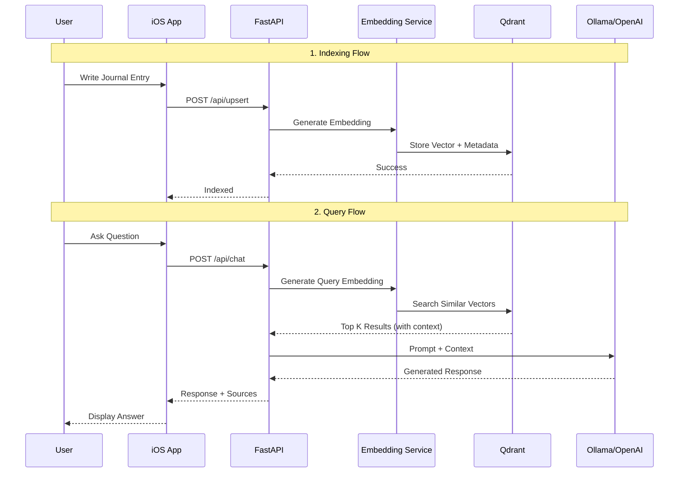
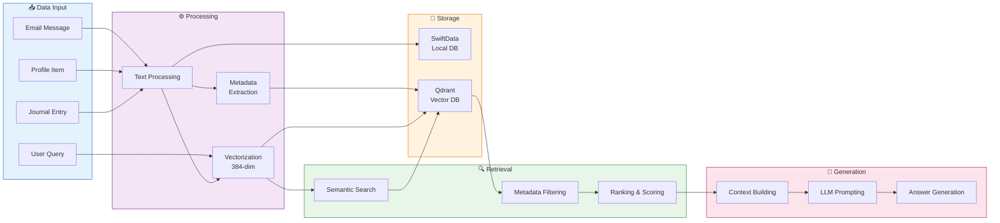

# MindVault 🧠

A personal AI-powered journal assistant that remembers everything about you. Write journal entries, record your skills, education, and experiences, and let your AI assistant answer questions about your life.

## Features

- 📝 **Personal Journal**: Write daily entries with categories, tags, and mood tracking
- 👤 **Profile Builder**: Record your skills, education, work experience, certifications, and more
- 🤖 **AI Chat**: Ask questions about your life, and get answers based on your journal
- 🎤 **Voice Support**: Speak your thoughts and have AI responses read aloud
- 📧 **Email Integration**: Connect Gmail and convert emails to journal entries (configurable in-app)
- 🔍 **RAG-Powered**: Uses Retrieval-Augmented Generation for accurate, contextual responses
- 🔒 **Privacy-Focused**: Your data stays on your infrastructure
- 🦙 **Ollama Support**: Run AI models 100% locally - no API keys needed!journal entries (configurable in-app)
- 🔍 **RAG-Powered**: Uses Retrieval-Augmented Generation for accurate, contextual responses
- 🔒 **Privacy-Focused**: Your data stays on your infrastructure
- 🦙 **Ollama Support**: Run AI models 100% locally - no API keys needed!

## Architecture



### RAG Pipeline Flow



### Data Flow Architecture



## Prerequisites

- **iOS Development**: Xcode 15+, iOS 17+
- **Backend**: 
  - Python 3.9+
  - **Ollama** (for local LLM) ⭐ **RECOMMENDED** - 100% free, runs locally
  - OR OpenAI API key (for cloud LLM)
  - Qdrant (vector database) - runs via Docker

## Quick Start

### 0. Setup Ollama (Optional but Recommended - 100% Free)

```bash
# Install Ollama
brew install ollama

# Start Ollama service (in a terminal)
ollama serve

# Pull a model (in another terminal)
ollama pull llama3.2:3b  # Fast & good quality
```

💡 **Tip:** With Ollama, you don't need OpenAI API key! Skip the .env configuration below.

### 1. Start the Backend

```bash
# Clone and navigate to the project
cd MindVault

# Copy environment file
cp backend/.env.example backend/.env

# If using Ollama (default):
# - No changes needed! It's already configured for Ollama

# If using OpenAI instead:
# - Edit backend/.env and add: OPENAI_API_KEY=your-key-here
# - Change LLM_MODEL to: gpt-4-turbo-preview

# Start services with Docker
docker-compose up -d
```

### 2. Verify Backend is Running

```bash
# Check health
curl http://localhost:8000/health

# Expected response:
# {"status":"ok","vector_db_status":"connected","embeddings_ready":true}
```

### 3. Run the iOS App

1. Open `MindVault.xcodeproj` in Xcode
2. Select your target device/simulator
3. Build and run (⌘R)

## Project Structure

```
MindVault/
├── MindVault/                    # iOS App
│   ├── MindVaultApp.swift        # App entry point
│   ├── ContentView.swift         # Main content view
│   ├── Models/                   # SwiftData models
│   │   ├── JournalEntry.swift
│   │   ├── ProfileItem.swift
│   │   └── ChatMessage.swift
│   ├── Views/                    # SwiftUI views
│   │   ├── Journal/
│   │   ├── Chat/
│   │   └── Profile/
│   ├── Services/                 # AI/RAG services
│   │   ├── EmbeddingService.swift
│   │   ├── VectorDBService.swift
│   │   ├── LLMService.swift
│   │   └── RAGService.swift
│   └── Utilities/
│       ├── APIClient.swift
│       └── Configuration.swift
│
├── backend/                      # Python FastAPI Backend
│   ├── app/
│   │   ├── main.py              # FastAPI app
│   │   ├── config.py            # Configuration
│   │   ├── models.py            # Pydantic models
│   │   └── services/
│   │       ├── embedding.py     # OpenAI embeddings
│   │       ├── vector_db.py     # Qdrant operations
│   │       ├── llm.py           # Chat completion
│   │       └── rag.py           # RAG orchestration
│   ├── requirements.txt
│   ├── Dockerfile
│   └── .env.example
│
└── docker-compose.yml            # Docker setup
```

## API Endpoints

| Endpoint | Method | Description |
|----------|--------|-------------|
| `/health` | GET | Health check |
| `/api/embed` | POST | Generate text embedding |
| `/api/upsert` | POST | Add/update document in vector DB |
| `/api/delete` | DELETE | Remove document from vector DB |
| `/api/search` | POST | Search for similar documents |
| `/api/chat` | POST | Generate AI response with RAG |
| `/api/stats` | GET | Get collection statistics |

## Configuration

### iOS App Settings

Navigate to Profile → Settings in the app to configure:

- **Server URL**: Backend API URL (default: `http://localhost:8000`)
- **Auto-sync**: Automatically sync new entries to AI
- **Email Accounts**: Connect Gmail with one tap
  - Users just click "Connect Gmail Account" and authorize
  - Emails are automatically synced and processed for RAG context
  - No manual configuration needed by users
  
**Developer Setup (One-time):**
To enable Gmail integration, configure the Client ID in `EmailService.swift`:
1. Go to [Google Cloud Console](https://console.cloud.google.com/apis/credentials)
2. Create project → Enable Gmail API → Create OAuth Client ID (iOS)
3. Copy the Client ID and paste it in `EmailService.swift` line 23
4. Users can then connect their Gmail accounts seamlessly

### Backend Environment Variables

| Variable | Description | Default |
|----------|-------------|---------|
| `USE_OLLAMA` | Use local Ollama instead of OpenAI | `true` |
| `OLLAMA_BASE_URL` | Ollama API endpoint | `http://localhost:11434` |
| `OLLAMA_MODEL` | Ollama model to use | `llama3.2:3b` |
| `OPENAI_API_KEY` | OpenAI API key (if not using Ollama) | Optional |
| `QDRANT_HOST` | Qdrant host | `localhost` |
| `QDRANT_PORT` | Qdrant port | `6333` |
| `EMBEDDING_MODEL` | OpenAI embedding model | `text-embedding-3-small` |
| `LLM_MODEL` | OpenAI chat model (if not using Ollama) | `gpt-4-turbo-preview` |

💡 **See `OLLAMA_SETUP.md` for complete Ollama setup and model selection guide**

## Usage Examples

### Adding Journal Entries

1. Tap the **+** button in the Journal tab
2. Write your entry (or use voice input)
3. Select a category and add tags
4. Optionally track your mood
5. Save - the entry will be automatically synced to AI

### Asking Questions

Try questions like:
- "What are my top skills?"
- "Summarize my career journey"
- "What were my goals this year?"
- "Am I qualified for a senior developer role?"
- "What patterns do you see in my journal?"

### Building Your Profile

Add comprehensive profile items:
- **Skills**: Programming languages, tools, soft skills
- **Education**: Degrees, certifications, bootcamps
- **Experience**: Jobs, roles, responsibilities
- **Projects**: Personal and professional projects
- **Achievements**: Awards, milestones, accomplishments

## Development

### Running Backend Locally (without Docker)

```bash
cd backend

# Create virtual environment
python -m venv venv
source venv/bin/activate

# Install dependencies
pip install -r requirements.txt

# Set environment variables
export OPENAI_API_KEY=your-key-here

# Run Qdrant separately
docker run -p 6333:6333 qdrant/qdrant

# Start the server
uvicorn app.main:app --reload
```

### Running Tests

```bash
# Backend tests
cd backend
pytest

# iOS tests
xcodebuild test -project MindVault.xcodeproj -scheme MindVault
```

## Privacy & Security

- All data is stored locally on your device and your self-hosted backend
- Journal entries are never sent to third parties (except OpenAI for embeddings/chat if using OpenAI)
- You control your Qdrant instance and all stored embeddings
- API keys are stored securely in iOS Keychain and never logged
- Email OAuth tokens are hardware-encrypted in Keychain

## Documentation

For detailed guides, see the `docs/` folder:

- **[QUICK_START.md](QUICK_START.md)** - Quick reference for common tasks and troubleshooting
- **[OLLAMA_SETUP.md](docs/OLLAMA_SETUP.md)** - Complete Ollama installation, model selection, and configuration
- **[EMAIL_CONFIGURATION_GUIDE.md](docs/EMAIL_CONFIGURATION_GUIDE.md)** - Step-by-step Gmail integration setup
- **[ENABLING_EMAIL_FEATURES.md](docs/ENABLING_EMAIL_FEATURES.md)** - How to enable email features (5 minutes)

## Roadmap

### Completed ✅
- [x] Local LLM support (Ollama with Llama models)
- [x] Voice input and output (Speech-to-text & Text-to-speech)
- [x] Email integration (Gmail OAuth, in-app configuration)
- [x] Secure credential storage (iOS Keychain)

### Coming Soon
- [ ] On-device embeddings (MLX/ONNX)
- [ ] iCloud sync for journal entries
- [ ] Apple Watch companion app
- [ ] Siri integration
- [ ] Export/import functionality
- [ ] Multiple AI personas
- [ ] Advanced analytics and insights
- [ ] Email auto-summarization
- [ ] Background email sync

## License

MIT License - see [LICENSE](LICENSE) for details.

## Contributing

Contributions are welcome! Please read our contributing guidelines and submit pull requests.

---

Built with ❤️ using SwiftUI, FastAPI, Qdrant, and OpenAI
