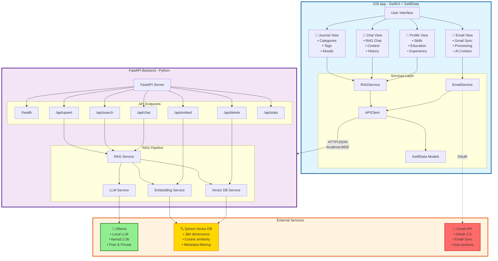
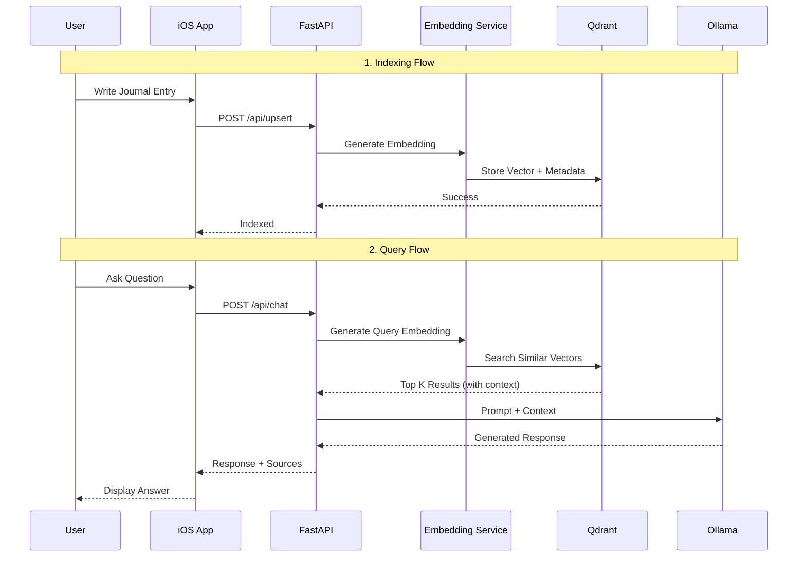
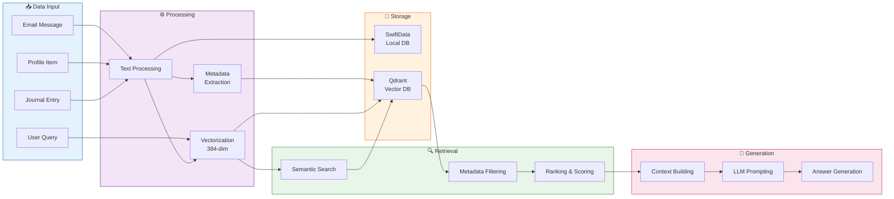

# MindVault 🧠

A personal AI-powered journal assistant that remembers everything about you. Write journal entries, record your skills, education, and experiences, and let your AI assistant answer questions about your life.

## Features

- 📝 **Personal Journal**: Write daily entries with categories, tags, and mood tracking
- 👤 **Profile Builder**: Record your skills, education, work experience, certifications, and more
- 🤖 **AI Chat**: Ask questions about your life, and get answers based on your journal
- 🎤 **Voice Support**: Speak your thoughts and have AI responses read aloud
- 📧 **Email Integration**: Connect Gmail and convert emails to journal entries (configurable in-app)
- 🔍 **RAG-Powered**: Uses Retrieval-Augmented Generation for accurate, contextual responses
- 🔒 **Privacy-Focused**: Your data stays on your infrastructure
- 🦙 **Ollama Support**: Run AI models 100% locally - no API keys needed!
- 📱 **On-Device Mode**: Run the whole pipeline on the iPhone itself — no Mac, no server, no network

## AI Modes

Pick a mode in **Profile → Settings → AI Mode**. Each one changes where embedding,
search, and generation actually run:

| Mode | Retrieval | Generation | Needs a server? | Privacy |
|---|---|---|---|---|
| **AI Backend (Ollama)** | Backend + Qdrant | Ollama on your Mac | Yes — Mac on the same network | Local network |
| **OpenAI (BYOK)** | Backend + Qdrant | OpenAI API, called directly from the phone | Yes, for search | Prompts go to OpenAI |
| **On-Device** | `NLEmbedding` + on-device vector store | MLX running on the iPhone | **No** | Never leaves the device |

### On-Device mode

Everything runs on the phone:

- **Embeddings** — Apple's built-in `NLEmbedding.sentenceEmbedding`. No download, no network.
- **Vector search** — `LocalVectorStore`, a JSON-backed store with `vDSP` cosine similarity.
- **Generation** — [MLX](https://github.com/ml-explore/mlx-swift-lm) running a 4-bit quantized model on the GPU.
- **Dictation** — forced to on-device speech recognition, so audio is never uploaded.

Download models in-app from **Settings → AI Mode → Browse Models**. Curated options,
all verified to fit an iPhone 16 Plus (A18, 8 GB RAM):

| Model | Size | Tier |
|---|---|---|
| Llama 3.2 1B | ~0.7 GB | Fast |
| Gemma 3 1B | ~0.8 GB | Fast |
| **Llama 3.2 3B** | ~1.8 GB | **Balanced — recommended** |
| Qwen 2.5 3B | ~1.9 GB | Balanced |
| Phi 3.5 Mini | ~2.2 GB | Balanced |
| Gemma 3 4B | ~2.5 GB | Balanced |
| Mistral 7B | ~4.1 GB | Quality |

**One-time Xcode setup to enable on-device generation** — two packages, both via
**File → Add Package Dependencies…**:

1. `https://github.com/ml-explore/mlx-swift-lm` (Up to Next Major, from `3.31.3`)
   → add **MLXLLM**, **MLXLMCommon**, and **MLXHuggingFace** to the MindVault target
2. `https://github.com/huggingface/swift-transformers` (Up to Next Major, from `1.3.4`)
   → add **Tokenizers** to the MindVault target

The second package is easy to miss: mlx-swift-lm's tokenizer loader expands to code
that calls into `swift-transformers` directly, but mlx-swift-lm doesn't declare it as
a package dependency — Xcode won't pull it in for you.

**⚠️ MLX cannot run in the iOS Simulator — you need a physical device.** MLX requires a
Metal `MTLGPUFamily` the Simulator doesn't provide; trying anyway fails with `failed
assertion 'Dispatch Threads with Non-Uniform Threadgroup Size is not supported on this
device'`. That's a platform limitation, not a bug in this code. Options:
- Run on a physical iPhone (A17 Pro or newer for good performance)
- Add the **"Mac (Designed for iPad)"** destination in Xcode and run there instead —
  Apple Silicon Macs have a full Metal GPU
- UI and non-MLX features (Backend/BYOK modes, journal, everything else) work fine in
  the Simulator as always; only `MLXArray` evaluation needs real Apple Silicon

**Memory:** iOS kills apps that use too much RAM ([jetsam](https://developer.apple.com/documentation/xcode/identifying-high-memory-use-with-jetsam-event-reports)).
The larger catalog models (Gemma 3 4B, Mistral 7B) may need the
[Increased Memory Limit entitlement](https://developer.apple.com/documentation/bundleresources/entitlements/com_apple_developer_kernel_increased-memory-limit)
(Xcode → target → Signing & Capabilities → **+ Capability** → "Increased Memory Limit")
to avoid termination on devices where RAM would otherwise allow it. Not required for the
Fast-tier models (~0.7–0.8 GB).

Requires **Xcode 26+** (mlx-swift-lm is swift-tools-version 6.2) and iOS 17+. An A17 Pro
or newer device is recommended — inference runs on the GPU via Metal. Until both packages
are linked, the app builds and runs normally and On-Device mode reports that generation
isn't available yet; retrieval and embedding already work without it.

> Google Drive documents: On-Device mode indexes PDFs, Google Docs, and text files
> using PDFKit. `.docx` / `.pptx` still need the backend's parsers.

## Architecture



### RAG Pipeline Flow



### Data Flow Architecture



## Prerequisites

- **iOS Development**: Xcode 15+, iOS 17+ (Xcode 26+ only if you want On-Device generation)
- **Backend** — *not needed if you only use On-Device mode*:
  - Python 3.9+
  - **Ollama** (local LLM) - 100% free, runs locally
  - Qdrant (vector database) - runs via Docker

## Quick Start

### 0. Setup Ollama (Required - 100% Free)

```bash
# Install Ollama
brew install ollama

# Start Ollama service (in a terminal)
ollama serve

# Pull a model (in another terminal)
ollama pull llama3.2:3b  # Fast & good quality
```

💡 **Tip:** Everything runs locally — no API keys anywhere in the stack.

### 1. Start the Backend

```bash
# Clone and navigate to the project
cd MindVault

# Copy environment file
cp backend/.env.example backend/.env

# The defaults already point at local Qdrant and Ollama — no changes needed

# Start services with Docker
docker-compose up -d
```

### 2. Verify Backend is Running

```bash
# Check health
curl http://localhost:8000/health

# Expected response:
# {"status":"ok","vector_db_status":"connected","embeddings_ready":true}
```

### 3. Run the iOS App

1. For Gmail/Drive sign-in, `cp Config.local.xcconfig.example Config.local.xcconfig` and set your
   Google OAuth iOS client ID (see [docs/EMAIL_CONFIGURATION_GUIDE.md](docs/EMAIL_CONFIGURATION_GUIDE.md)).
   Skip this and the app runs fine with those integrations disabled.
2. Open `MindVault.xcodeproj` in Xcode
3. Select your target device/simulator
4. Build and run (⌘R)

## Project Structure

```
MindVault/
├── MindVault/                    # iOS App
│   ├── MindVaultApp.swift        # App entry point
│   ├── ContentView.swift         # Main content view
│   ├── Models/                   # SwiftData models
│   │   ├── JournalEntry.swift
│   │   ├── ProfileItem.swift
│   │   └── ChatMessage.swift
│   ├── Views/                    # SwiftUI views
│   │   ├── Journal/
│   │   ├── Chat/
│   │   └── Profile/
│   │       ├── ProfileView.swift        # Includes SettingsView (AI Mode)
│   │       └── ModelBrowserView.swift   # Download/select on-device models
│   ├── Services/                 # AI/RAG services
│   │   ├── EmbeddingService.swift       # Backend or on-device (NLEmbedding)
│   │   ├── VectorDBService.swift        # Routes to Qdrant or LocalVectorStore
│   │   ├── LocalVectorStore.swift       # On-device vectors + vDSP search
│   │   ├── LLMProvider.swift            # Backend / OpenAI / MLX providers
│   │   ├── ModelCatalog.swift           # Model catalog + HF downloader
│   │   ├── LLMService.swift
│   │   └── RAGService.swift
│   └── Utilities/
│       ├── APIClient.swift
│       └── Configuration.swift
│
├── backend/                      # Python FastAPI Backend
│   ├── app/
│   │   ├── main.py              # FastAPI app
│   │   ├── config.py            # Configuration
│   │   ├── models.py            # Pydantic models
│   │   └── services/
│   │       ├── embedding.py     # Local sentence-transformers embeddings
│   │       ├── vector_db.py     # Qdrant operations
│   │       ├── llm.py           # Chat completion
│   │       └── rag.py           # RAG orchestration
│   ├── requirements.txt
│   ├── Dockerfile
│   └── .env.example
│
└── docker-compose.yml            # Docker setup
```

## API Endpoints

| Endpoint | Method | Description |
|----------|--------|-------------|
| `/health` | GET | Health check |
| `/api/embed` | POST | Generate text embedding |
| `/api/upsert` | POST | Add/update document in vector DB |
| `/api/delete` | DELETE | Remove document from vector DB |
| `/api/search` | POST | Search for similar documents |
| `/api/chat` | POST | Generate AI response with RAG |
| `/api/stats` | GET | Get collection statistics |

## Configuration

### iOS App Settings

Navigate to Profile → Settings in the app to configure:

- **AI Mode**: Backend / OpenAI (BYOK) / On-Device — see [AI Modes](#ai-modes) above
- **Server URL**: Backend API URL (shown in Backend mode; default: `http://localhost:8000`)
- **OpenAI API Key**: Stored in the iOS Keychain, never in UserDefaults (BYOK mode)
- **Browse Models**: Download and select on-device MLX models (On-Device mode)
- **Auto-sync**: Automatically sync new entries to AI
- **Sync All Now / Clear AI Data**: Re-index or wipe the search index (journal entries themselves are untouched)
- **Email Accounts**: Connect Gmail with one tap
  - Users just click "Connect Gmail Account" and authorize
  - Emails are automatically synced and processed for RAG context
  - No manual configuration needed by users
  
**Developer Setup (One-time):**
To enable Gmail integration, configure the Client ID in `EmailService.swift`:
1. Go to [Google Cloud Console](https://console.cloud.google.com/apis/credentials)
2. Create project → Enable Gmail API → Create OAuth Client ID (iOS)
3. Copy the Client ID and paste it into `gmailClientId` in `EmailService.swift`
4. Users can then connect their Gmail accounts seamlessly

### Backend Environment Variables

See [`backend/.env.example`](backend/.env.example) for a copy-paste starting point.

| Variable | Description | Default |
|----------|-------------|---------|
| `QDRANT_HOST` | Qdrant host | `localhost` |
| `QDRANT_PORT` | Qdrant port | `6333` |
| `QDRANT_COLLECTION` | Qdrant collection name | `mindvault` |
| `QDRANT_URL` | Qdrant Cloud URL (optional) | Unset |
| `QDRANT_API_KEY` | Qdrant Cloud API key (optional) | Unset |
| `HOST` | Bind address | `0.0.0.0` |
| `PORT` | Bind port | `8000` |
| `DEBUG` | Enable uvicorn reload | `true` |
| `EMBEDDING_MODEL` | Local sentence-transformers model | `all-MiniLM-L6-v2` |
| `EMBEDDING_DIMENSION` | Embedding size (must match the model) | `384` |
| `OLLAMA_URL` | Ollama API endpoint | `http://localhost:11434` |
| `LLM_MODEL` | Ollama model to use | `llama3.2` |
| `LLM_MAX_TOKENS` | Max tokens per response | `2000` |
| `LLM_TEMPERATURE` | Sampling temperature | `0.7` |
| `RAG_TOP_K` | Documents retrieved per query | `5` |
| `RAG_MIN_SCORE` | Minimum similarity score | `0.1` |

> The backend is Ollama-only — there is no OpenAI code path, so no API key is needed or read.

💡 **See `OLLAMA_SETUP.md` for complete Ollama setup and model selection guide**

## Usage Examples

### Adding Journal Entries

1. Tap the **+** button in the Journal tab
2. Write your entry (or use voice input)
3. Select a category and add tags
4. Optionally track your mood
5. Save - the entry will be automatically synced to AI

### Asking Questions

Try questions like:
- "What are my top skills?"
- "Summarize my career journey"
- "What were my goals this year?"
- "Am I qualified for a senior developer role?"
- "What patterns do you see in my journal?"

### Building Your Profile

Add comprehensive profile items:
- **Skills**: Programming languages, tools, soft skills
- **Education**: Degrees, certifications, bootcamps
- **Experience**: Jobs, roles, responsibilities
- **Projects**: Personal and professional projects
- **Achievements**: Awards, milestones, accomplishments

## Development

### Running Backend Locally (without Docker)

```bash
cd backend

# Create virtual environment
python -m venv venv
source venv/bin/activate

# Install dependencies
pip install -r requirements.txt

# Run Qdrant separately
docker run -p 6333:6333 qdrant/qdrant

# Start the server
uvicorn app.main:app --reload
```

### Running Tests

```bash
# Backend tests and lint (no Qdrant or Ollama needed - both are mocked)
pip install -r backend/requirements-dev.txt
./dev.sh test
./dev.sh lint

# iOS tests
xcodebuild test -project MindVault.xcodeproj -scheme MindVault
```

## Privacy & Security

- All data is stored locally on your device and your self-hosted backend
- You control your Qdrant instance and all stored embeddings
- API keys are stored securely in iOS Keychain and never logged
- Email OAuth tokens are hardware-encrypted in Keychain
- Dictation uses on-device speech recognition when the device supports it; in
  On-Device mode it refuses to fall back to Apple's servers rather than
  silently uploading audio

What leaves the device depends on the AI mode:

- **On-Device** — nothing. Embedding, search, and generation all run on the phone.
- **AI Backend** — entries go to your own machine on your own network; nothing to third parties.
- **OpenAI (BYOK)** — retrieved context and your question are sent to OpenAI to
  generate each answer. Everything else stays on your infrastructure.

## Documentation

For detailed guides, see the `docs/` folder:

- **[QUICK_START.md](QUICK_START.md)** - Quick reference for common tasks and troubleshooting
- **[OLLAMA_SETUP.md](docs/OLLAMA_SETUP.md)** - Complete Ollama installation, model selection, and configuration
- **[EMAIL_CONFIGURATION_GUIDE.md](docs/EMAIL_CONFIGURATION_GUIDE.md)** - Step-by-step Gmail integration setup
- **[ENABLING_EMAIL_FEATURES.md](docs/ENABLING_EMAIL_FEATURES.md)** - How to enable email features (5 minutes)

## Roadmap

### Completed ✅
- [x] Local LLM support (Ollama with Llama models)
- [x] Voice input and output (Speech-to-text & Text-to-speech)
- [x] Email integration (Gmail OAuth, in-app configuration)
- [x] Secure credential storage (iOS Keychain)
- [x] BYOK mode (bring your own OpenAI key)
- [x] On-device embeddings (`NLEmbedding`)
- [x] On-device vector store (vDSP cosine similarity)
- [x] On-device LLM generation (MLX) with in-app model downloads

### Coming Soon
- [ ] iCloud sync for journal entries
- [ ] Apple Watch companion app
- [ ] Siri integration
- [ ] Export/import functionality
- [ ] Multiple AI personas
- [ ] Advanced analytics and insights
- [ ] Email auto-summarization
- [ ] Background email sync

## License

MIT License - see [LICENSE](LICENSE) for details.

## Contributing

Contributions are welcome! Please read our contributing guidelines and submit pull requests.

---

Built with ❤️ using SwiftUI, FastAPI, Qdrant, and OpenAI
